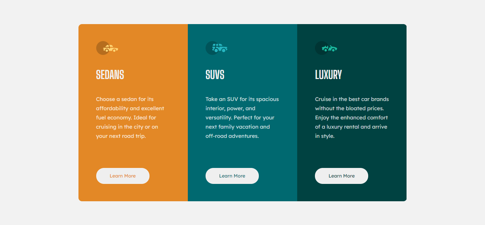

## Table of contents

-   [Overview](#overview)
    -   [The challenge](#the-challenge)
    -   [Screenshot](#screenshot)
    -   [Links](#links)
-   [My process](#my-process)
    -   [Built with](#built-with)
    -   [Useful resources](#useful-resources)
    -   [Note](#note)
-   [Author](#author)

## Overview

### The challenge

Users should be able to:

-   View the optimal layout depending on their device's screen size
-   See hover states for interactive elements

### Screenshot

### Links

-   Solution URL: [Github](https://github.com/rizky-pm/fm_three-column-preview-card-component)
-   Live Site URL: [Github Pages](https://rizky-pm.github.io/fm_three-column-preview-card-component/)

## My process

### Built with

-   Naming Block Element Modifier (BEM)
-   SCSS
-   @each rule to repeat 3 columns
-   CSS Grid
-   Desktop-first workflow
-   Media Query

### Useful resources

-   [CSS Grid System](https://css-tricks.com/snippets/css/complete-guide-grid/)

### Note

-   Somehow `css .card {padding-bottom} ` does not work on mobile media query at Google Chrome, but when i use Microsoft Edge it works. Any advice will be appreciate.

## Author

-   Frontend Mentor - [@rizky-pm](https://www.frontendmentor.io/profile/rizky-pm)
-   Twitter - [@\_rizkypm](https://twitter.com/_rizkypm)
